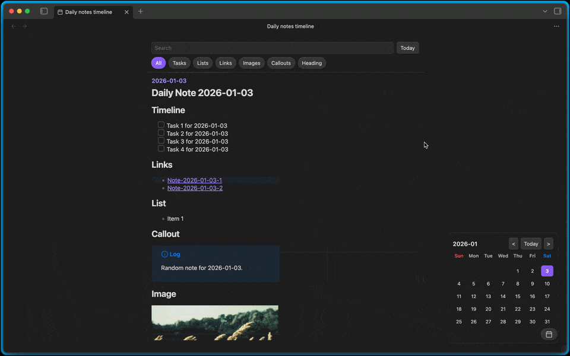
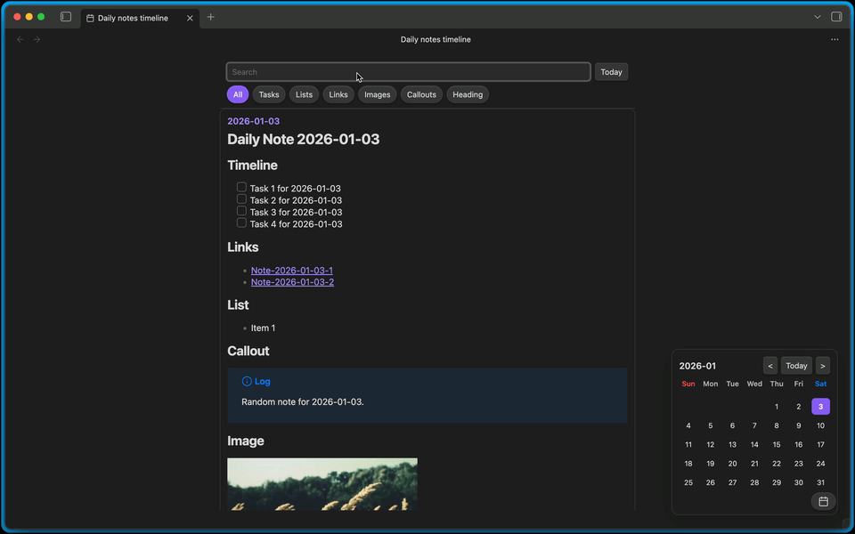

# Daily Notes Timeline

 

Timeline view for Obsidian daily notes, focused on browsing and review.

## ✨️Features

### 🔁 Infinite scroll

Renders only around the visible portion to enable infinite scroll.
Jump to a date from the calendar UI.

### 🧹 Filtering

Extracts landmarks. Supported items:

- Tasks 
- Lists
- Links
- Images
- Callouts
- Heading

### 🔍 Search

Filter by any search term and display with highlights.

## Usage

Recommended: Install via [BRAT](https://github.com/TfTHacker/obsidian42-brat) 

Enable the plugin and run **Open daily notes timeline** from the command palette.

> [!note]
> This plugin inherits settings from the core plugin `Daily Notes`, thanks to the [Obsidian Daily Notes interface](https://github.com/liamcain/obsidian-daily-notes-interface).